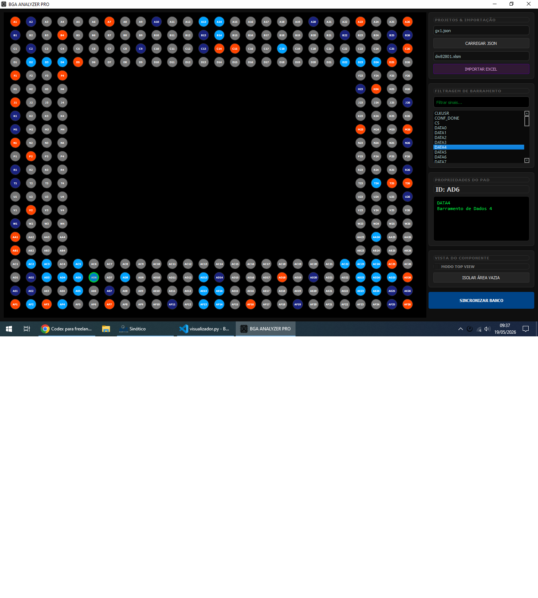

# BGA Curve Mapper

Aplicativo em PyQt5 para visualizar, importar e editar mapeamentos de pinagem BGA a partir de arquivos JSON e Excel.

## Screenshot



## Estrutura

- `visualizador.py`: ponto de entrada da aplicação.
- `ui/`: telas, splash e widgets.
- `services/`: leitura de arquivos, JSON e Excel.
- `models/`: modelos de dados da aplicação.
- `utils/`: configurações, estilos e utilitários.
- `data/`: bancos JSON.
- `excels/`: planilhas de entrada.

## Execução

```bash
python visualizador.py
```
